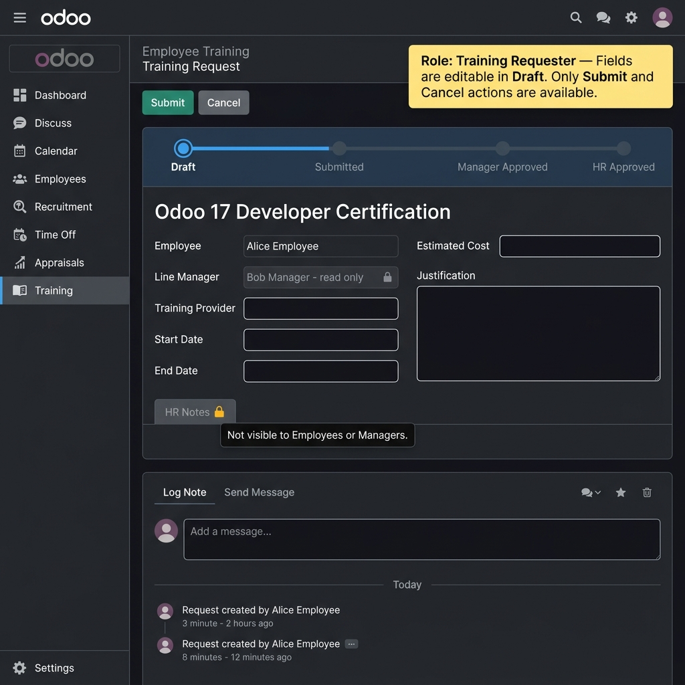
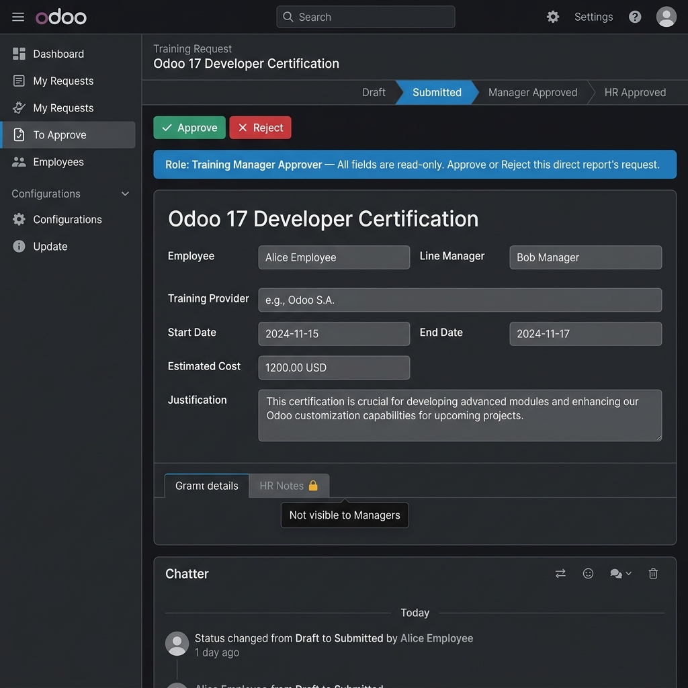
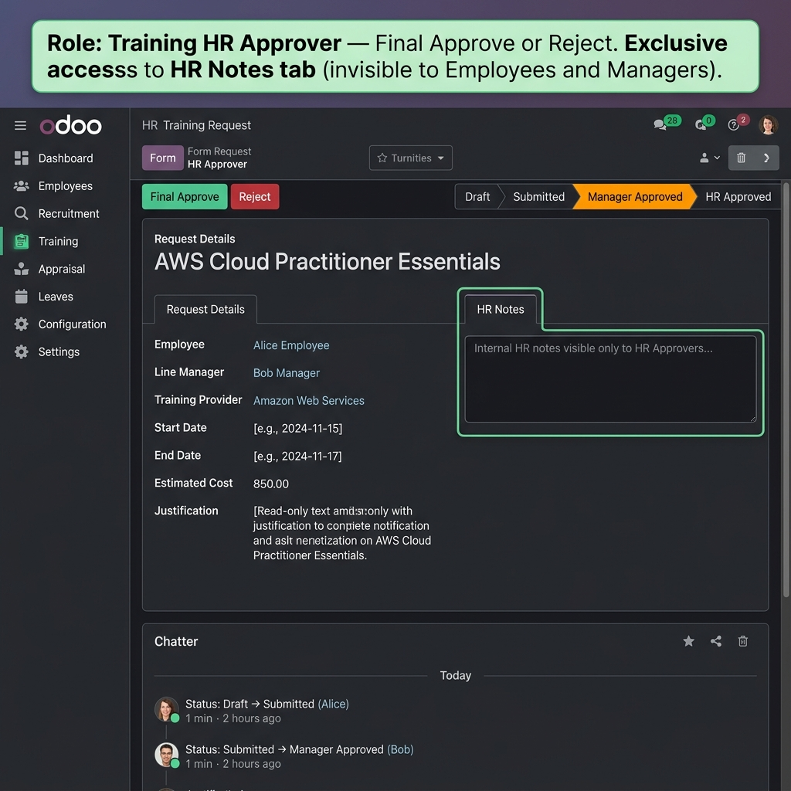

# HR Training Request Module (`hr_training_request`)

> **Odoo Version:** 17.0 Community  
> **Author:** HSG  
> **License:** LGPL-3

---

## Overview

`hr_training_request` is a custom Odoo module that enables employees to formally request external training or certifications, routed through a structured, role-gated multi-stage approval workflow involving their line manager and an HR approver.

**Core design philosophy:** A smaller, correctly-secured module beats a feature-rich one with access holes. Security is implemented at four independent layers — no single point of failure.

---

## Installation

1. Place the `hr_training_request/` directory in your Odoo addons path.
2. Restart the Odoo server (or update the apps list).
3. Navigate to **Settings → Apps** and search for "HR Training Request".
4. Click **Install**.
5. If installing in demo mode, demo users, employees, and sample requests are created automatically.

**Demo credentials (demo mode only):**

| User | Login | Password | Role |
|------|-------|----------|------|
| Alice Employee | `alice.employee` | `odoo` | Training Requester |
| Bob Manager | `bob.manager` | `odoo` | Training Manager Approver |
| Carol HR | `carol.hr` | `odoo` | Training HR Approver |

---

## Security Group Hierarchy & Rationale

```
hr.group_hr_user  (Odoo base HR)
    └── group_training_requester  (Training Requester)
            └── group_training_manager  (Training Manager Approver)
                    └── group_training_hr  (Training HR Approver)
```

### Why this hierarchy?

Each group inherits all permissions of the group below it via Odoo's `implied_ids` mechanism. This means:

- **HR Approvers** have all Manager capabilities plus company-wide visibility and HR notes access.
- **Managers** have all Requester capabilities plus team-level visibility.
- **ACL management is simplified** — no duplicate entries needed.

**Tradeoff acknowledged:** Because HR Approvers inherit from Managers, they technically belong to the Requester group too. The "Submit" button's XML `invisible` attribute checks state (`draft`), but even if an HR user somehow saw the button, the Python `action_submit()` guard enforces owner-only access. This is the correct way to handle it — XML is UI convenience; Python is enforcement.

---

## Defense-in-Depth Security Architecture

Security is enforced at **four independent layers**, each capable of blocking unauthorized access on its own:

| Layer | Mechanism | Where | Bypassed by client? |
|-------|-----------|-------|---------------------|
| **Layer 1 (DB)** | `ir.rule` SQL WHERE clause injection | Database | ❌ No |
| **Layer 2 (ORM)** | `ir.model.access.csv` + `groups=` on `hr_notes` field | ORM | ❌ No |
| **Layer 3 (Python)** | `action_*()` guard methods in model | Server | ❌ No |
| **Layer 4 (UI)** | XML `groups=`, `invisible=` attrs | Client | ✅ Yes — intentional (UX only) |

### Record Rules Design

Three group-scoped rules (NOT global) so Odoo correctly ORs them for users in multiple groups:

| Group | Domain | Access |
|-------|--------|--------|
| `group_training_requester` | `[('employee_id.user_id', '=', user.id)]` | Own records only |
| `group_training_manager` | `['|', own, direct_reports]` | Own + team |
| `group_training_hr` | `[(1, '=', 1)]` | All records |

### `hr_notes` Field Restriction

```python
hr_notes = fields.Text(
    groups='hr_training_request.group_training_hr',
)
```

The `groups=` attribute on the field definition causes the ORM to:
1. Exclude the field from `fields_get()` for non-HR users
2. Raise `AccessError` on any direct read/write attempt by non-HR users
3. Strip the field from any RPC response automatically

This holds for **all access channels** — UI, XML-RPC, JSON-RPC, and ORM shell.

---

## State Machine

```
DRAFT ──── action_submit() ────► SUBMITTED
  │                                   │
  │                            Approve │ Reject
  │ action_cancel()                    │      │
  ▼                                    ▼      ▼
CANCELLED ◄── action_cancel()  MANAGER_APPROVED  REJECTED
                (from submitted)        │      │
                                 Approve│ Reject│
                                        ▼      ▼
                                   HR_APPROVED  REJECTED
```

### Guard Pattern (applied to every transition method)

```
Step 1: State pre-condition check   → UserError if wrong state
Step 2: Actor authorization check   → AccessError if wrong role/owner
Step 3: Business rule validation    → ValidationError if dates/cost invalid
Step 4: Execute state write
```

This pattern applies to **all channels**: UI buttons, XML-RPC calls, JSON-RPC calls, and direct ORM shell calls.

---

## Wireframes

### 1. Employee View (Draft Stage)


*Employee sees editable fields, Submit and Cancel buttons, HR Notes tab locked.*

### 2. Manager View (Submitted Stage)


*Manager sees all fields read-only, Approve/Reject buttons, HR Notes tab locked.*

### 3. HR Approver View (Manager Approved Stage)


*HR Approver sees Final Approve/Reject buttons, plus the exclusive HR Notes tab.*

---

## Assumptions Made

1. **`parent_id` linkage:** Manager-based record rules assume each employee has a correctly configured `parent_id` (line manager) on their `hr.employee` record. This is standard Odoo HR setup; we document it but do not validate it at install time.

2. **Single-company scope:** Record rules do not enforce company-based multi-tenancy. This is a known limitation; see "What I'd Improve" below.

3. **`mail` dependency:** The module depends on `mail` for `mail.thread`/`mail.activity.mixin` to get state change tracking in the chatter. This adds an optional-but-valuable audit trail without replacing the state machine.

4. **No `sudo()` usage:** No `sudo()` calls are made anywhere in this module. The `training_request_count` computed field uses `read_group()` without `sudo()`, which means each user's record rules apply to the count — an employee sees only their own count (correct behaviour).

5. **Reset to Draft:** An `action_reset_to_draft()` convenience method is included to allow employees to resubmit rejected/cancelled requests. This is not in the original FSM but is a practical necessity in real-world deployments.

6. **Cost field type:** `Float` is used instead of `Monetary` because `Monetary` requires a `currency_id` field. For the scope of this assignment a Float with 2 decimal places is sufficient. A `Monetary` field with company currency would be the production improvement.

---

## What I'd Improve With More Time

1. **Multi-company support:** Add `company_id` to the model and update record rules and actions with `('company_id', '=', user.company_id.id)` domain filters.

2. **Email notifications:** Add `mail.template` records to send automatic emails on each state transition (submission confirmation to employee, approval request to manager, etc.).

3. **`Monetary` field with currency:** Replace `Float` cost field with a proper `Monetary` field backed by `company_id.currency_id`.

4. **Scheduled reminders:** Add `mail.activity` or `base.automation` rules to flag requests that have been sitting at `submitted` or `manager_approved` for more than N days without action.

5. **Automated tests:** Add `tests/` directory with `TransactionCase` unit tests covering every guard method — ensuring all illegal state transitions and unauthorized actor attempts raise the correct exceptions.

6. **Kanban view:** Add a Kanban view for HR Approvers to get a visual pipeline overview of all requests by state.

7. **Reporting:** Add a pivot/graph view for HR to analyse training spend by department, employee, or time period.

8. **Archive instead of delete:** Override `unlink()` to soft-archive (toggle `active` field) instead of hard-delete, preserving audit history.

---

## Module Structure

```
hr_training_request/
├── __init__.py
├── __manifest__.py
├── README.md
├── models/
│   ├── __init__.py
│   ├── hr_training_request.py    ← Primary model + FSM guards
│   └── hr_employee.py            ← Computed count + smart button action
├── security/
│   ├── groups.xml                ← Three security group definitions
│   ├── ir.model.access.csv       ← Model-level CRUD per group
│   └── ir_rules.xml              ← Row-level record rules
├── views/
│   ├── hr_training_request_views.xml  ← Form, List, Search views
│   ├── hr_employee_views.xml          ← Smart button (xpath inheritance)
│   └── menus.xml                      ← Menu items + window actions
├── data/
│   └── demo_data.xml             ← Demo users, employees, requests
└── static/
    └── description/
        ├── wireframe_employee_draft.png
        ├── wireframe_manager_submitted.png
        └── wireframe_hr_manager_approved.png
```

---

*End of README*
